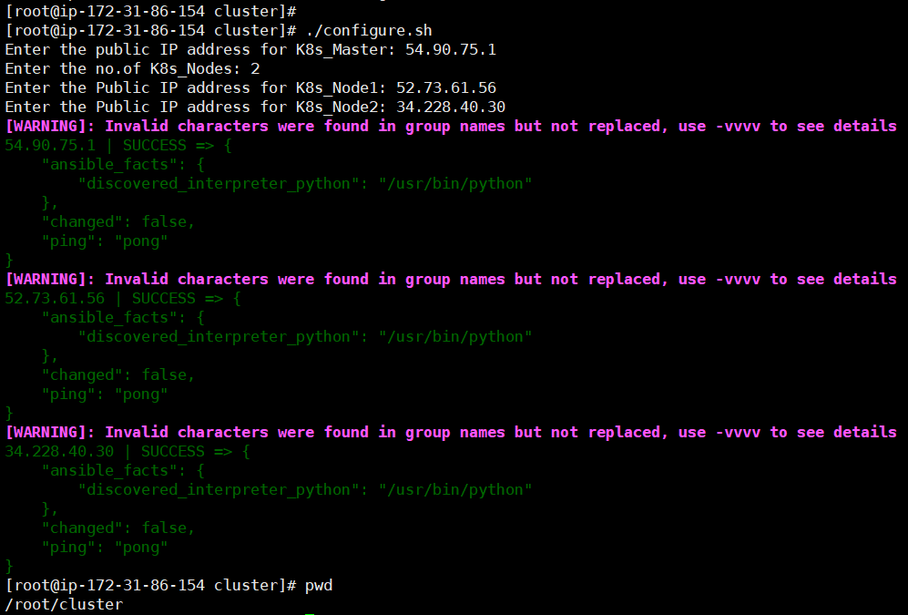
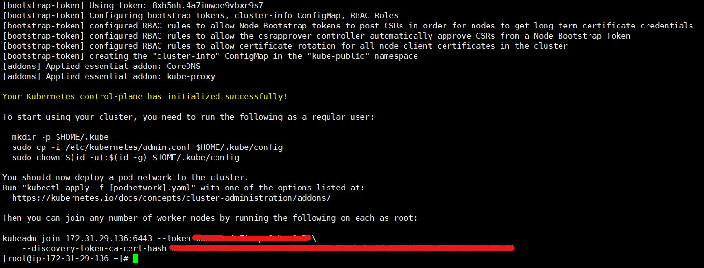
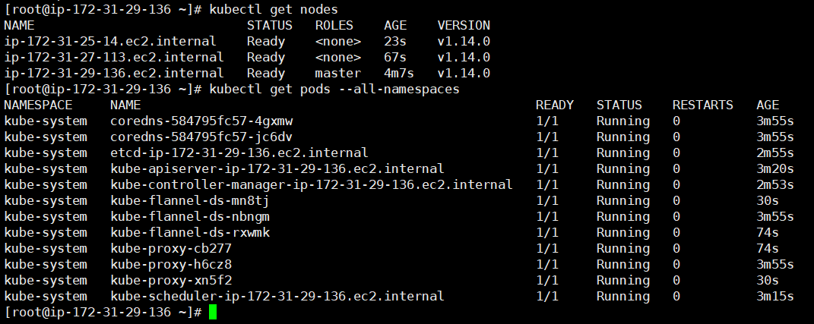
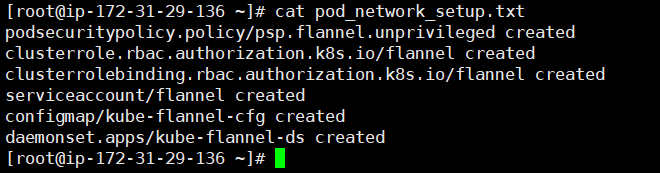

<h1 class="code-line" data-line-start=0 data-line-end=1 >Objective: Kubernetes cluster setup using Ansible</h1>

<h2 class="code-line" data-line-start=3 data-line-end=4 >Description:</h2>

I used an EC2 instance (CentOS) and installed Ansible on it, also used CentOS for the Kube servers. Used passwordless authentication between the Ansible server and the K8’s servers. I have created a script to avoid configuring the Ansible hosts manually and it will also verify the connection to the Kube servers are faultless. The script will ask for some details such as the public IP of K8’s Master, no. of K8’s Nodes for the cluster, and the public IPs of worker nodes. After that, I have initialized the Ansible roles and to set up the Kube cluster proper YAML files are placed under the respective roles. The YAML file consists of installing services and dependencies, also to satisfy the Kubernetes requirements I have used “Flannel” as an Overlay Network. The interesting fact is that I’m not touching the K8’s master and its nodes for configuration. The execution of the playbook will results in the K8’s cluster formation within 10 mins (PS: If you have a good internet connection).

<h2 class="code-line" data-line-start=7 data-line-end=8 >Prerequisite:</h2>
<ul>
<li class="has-line-data" data-line-start="9" data-line-end="10">A server with Ansible installed.</li>
<li class="has-line-data" data-line-start="10" data-line-end="11">A server for K8’s Master and ‘n’ no.of nodes (You can specify any no.of K8’s nodes)</li>
<li class="has-line-data" data-line-start="11" data-line-end="13">Public IP address of K8’s Master and ‘n’ nodes</li>
</ul>
<h2 class="code-line" data-line-start=13 data-line-end=14 >Steps:</h2>
<ul>
<li class="has-line-data" data-line-start="15" data-line-end="16">Step 1: Installed Ansible on a CentOS server.</li>
<li class="has-line-data" data-line-start="16" data-line-end="17">Step 2: Made passwordless authentication with the Ansible server and the K8’s servers.</li>
<li class="has-line-data" data-line-start="17" data-line-end="18">Step 3: Run the script <strong><a href="http://configure.sh">configure.sh</a></strong> which is present under the root directory.</li>
<li class="has-line-data" data-line-start="18" data-line-end="22">Step 4: The script will ask for the details such as:
<ol>
<li class="has-line-data" data-line-start="19" data-line-end="20">The public IP address of K8’s master</li>
<li class="has-line-data" data-line-start="20" data-line-end="21">No.of Kube nodes which you want to use for the cluster.</li>
<li class="has-line-data" data-line-start="21" data-line-end="22">The public IP address of “n” no. of nodes</li>
</ol>
</li>
<li class="has-line-data" data-line-start="22" data-line-end="23">Step 5: If the connections are perfect the script will show the ping result to the K8’s master and its nodes as an output.</li>
<li class="has-line-data" data-line-start="23" data-line-end="24">Step 6: Initialized the Ansible roles.</li>
<li class="has-line-data" data-line-start="24" data-line-end="26">Step 7: Run the setup.yml file with the Ansible playbook command.</li>
</ul>
<h2 class="code-line" data-line-start=26 data-line-end=27 >Installation:</h2>

Installing Ansible on CentOS server:

<pre><code class="has-line-data" data-line-start="30" data-line-end="33" class="language-sh">$ sudo yum update -y
$ sudo yum install ansible -y
</code></pre>

This would successfully install the Ansible. 
Also recommended to do an update after the installation of ansible

<h2 class="code-line" data-line-start=36 data-line-end=37 >File Locations:</h2>

The Shell Script and Yaml file are present under the directory named “cluster”.

<pre><code class="has-line-data" data-line-start="40" data-line-end="47" class="language-sh">[root@ip-172-31-86-154 cluster]# pwd
/root/cluster
[root@ip-172-31-86-154 cluster]# ll
total 8
-rwx------. 1 root root 1143 Jun 11 11:02 configure.sh
-rw-r--r--. 1 root root  109 Jun 11 06:30 setup.yml
</code></pre>
<h3 class="code-line" data-line-start=48 data-line-end=49 ><strong><em>Output of the Shell script:</em></strong></h3>

<h2 class="code-line" data-line-start=52 data-line-end=53 >Initializing Ansible roles:</h2>

Ansible-galaxy is the command to be used to re-define the Ansible roles 
I have initialized two roles, one for K8’s Master and one for K8’s nodes.

<pre><code class="has-line-data" data-line-start="57" data-line-end="62" class="language-sh"># ansible-galaxy init /etc/ansible/roles/kube_deploy_all --offline
- Role /etc/ansible/roles/kube_deploy_all was created successfully
# ansible-galaxy init /etc/ansible/roles/kube_deploy_master --offline
- Role /etc/ansible/roles/kube_deploy_master was created successfully
</code></pre>
<h2 class="code-line" data-line-start=63 data-line-end=64 >Ansible roles:</h2>
<h5 class="code-line" data-line-start=64 data-line-end=65 >Role 1: kube_deploy_all</h5>
<ul>
<li class="has-line-data" data-line-start="65" data-line-end="66">The configure.yml file consists of disabling SELinux, disabling swap, adding Kubernetes yum repositories, etc on all the K8’s servers.</li>
<li class="has-line-data" data-line-start="66" data-line-end="67">The install.yml file consists of installing docker service, kubectl, kubeadm, etc on all the K8’s servers.</li>
<li class="has-line-data" data-line-start="67" data-line-end="68">The service.yml file consists of starting the docker and kubelet service.</li>
</ul>
<pre><code class="has-line-data" data-line-start="69" data-line-end="91" class="language-sh">[root@ip-172-31-86-154 roles]# tree kube_deploy_all/
kube_deploy_all/
├── defaults
│   └── main.yml
├── files
├── handlers
│   └── main.yml
├── meta
│   └── main.yml
├── README.md
├── tasks
│   ├── configure.yml
│   ├── install.yml
│   ├── main.yml
│   └── service.yml
├── templates
├── tests
│   ├── inventory
│   └── test.yml
└── vars
    └── main.yml
</code></pre>
<h5 class="code-line" data-line-start=92 data-line-end=93 >Role 2: kube_deploy_master</h5>
<ul>
<li class="has-line-data" data-line-start="93" data-line-end="94">The configure.yml file consists of initializing the cluster, copying admin.conf contents to the user’s Kube configuration, installing the Pod overlay network (Flannel) on K8’s master.</li>
<li class="has-line-data" data-line-start="94" data-line-end="96">The install.yml file consists of installing the kubectl service on K8’s master.</li>
</ul>
<pre><code class="has-line-data" data-line-start="97" data-line-end="118" class="language-sh">[root@ip-172-31-86-154 roles]# tree kube_deploy_master/
kube_deploy_master/
├── defaults
│   └── main.yml
├── files
├── handlers
│   └── main.yml
├── meta
│   └── main.yml
├── README.md
├── tasks
│   ├── configure.yml
│   ├── install.yml
│   └── main.yml
├── templates
├── tests
│   ├── inventory
│   └── test.yml
└── vars
    └── main.yml
</code></pre>
<h2 class="code-line" data-line-start=118 data-line-end=119 >Ports to be allowed on the Kube servers:</h2>
<table class="table table-striped table-bordered">
<thead>
<tr>
<th style="text-align:left">Ports</th>
<th style="text-align:left">Description</th>
<th style="text-align:left">Server</th>
</tr>
</thead>
<tbody>
<tr>
<td style="text-align:left">6443/tcp</td>
<td style="text-align:left">Kubernetes API port</td>
<td style="text-align:left">All k8s servers</td>
</tr>
<tr>
<td style="text-align:left">2379-2380/tcp</td>
<td style="text-align:left">etcd server client API</td>
<td style="text-align:left">All k8s servers</td>
</tr>
<tr>
<td style="text-align:left">10250/tcp</td>
<td style="text-align:left">API which allows full node access</td>
<td style="text-align:left">All k8s servers</td>
</tr>
<tr>
<td style="text-align:left">10251/tcp</td>
<td style="text-align:left">kube-scheduler</td>
<td style="text-align:left">All k8s servers</td>
</tr>
<tr>
<td style="text-align:left">10252/tcp</td>
<td style="text-align:left">kube-controller-manager</td>
<td style="text-align:left">All k8s servers</td>
</tr>
<tr>
<td style="text-align:left">10255/tcp</td>
<td style="text-align:left">HTTP read-only port</td>
<td style="text-align:left">All k8s servers</td>
</tr>
<tr>
<td style="text-align:left">30000-32767/tcp</td>
<td style="text-align:left">NodePort Services</td>
<td style="text-align:left">Only on worker nodes</td>
</tr>
<tr>
<td style="text-align:left">6783-6784/tcp</td>
<td style="text-align:left">CNI ports</td>
<td style="text-align:left">Only on worker nodes</td>
</tr>
</tbody>
</table>
<h2 class="code-line" data-line-start=130 data-line-end=131 >Ansible playbook</h2>

Run the ansible playbook named “setup.yml”

<pre><code class="has-line-data" data-line-start="135" data-line-end="137" class="language-sh"># ansible-playbook setup.yml
</code></pre>

By running this file will install all the services, dependencies, Overlay Network, etc for the Kubernetes cluster setup. Upon completion of all the above steps, the Kubernetes cluster should be up and running. We can login to the master or worker nodes. The result of the successfull installation of the Kubernetes are stored on a file named “cluster_initialized.txt” on the root directory. On the same file there consists of the joining token for the worker nodes to join with the Kubernetes master. Executing the token on the worker nodes will finish the job.

<h2 class="code-line" data-line-start=139 data-line-end=140 >Outputs:</h2>
<h4 class="code-line" data-line-start=141 data-line-end=142 ><strong><em>Token for joining the worker nodes</em></strong></h4>

<h4 class="code-line" data-line-start=145 data-line-end=146 ><strong><em>All the pods are up and running</em></strong></h4>

<h4 class="code-line" data-line-start=149 data-line-end=150 ><strong><em>Details of created Overlay Network (Flannel)</em></strong></h4>

<h2 class="code-line" data-line-start=154 data-line-end=155 >Conclusion:</h2>

As we can see the master and worker nodes are in ready status. This concludes that kubernetes has been installed successfully and also successfully joined two worker nodes. Now its possible to create pods and services on this Kube Cluster.

<strong>Thank you</strong>

